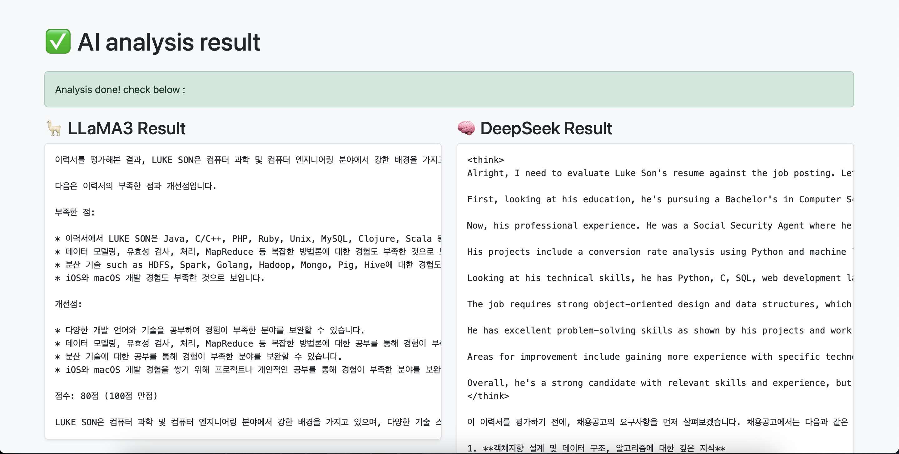

# 📄 ResumeAI Analyzer – AI Resume Screening Tool

A web application that uses two large language models (LLaMA3 and DeepSeek) from Groq to evaluate your resume (PDF) against a job description.  
The app provides feedback, a score, and suggestions — all in Korean — helping you tailor your resume for better alignment.

---

## 🌐 Live Demo

👉 https://resumeaianalyzer.onrender.com
---

## 🛠 Tech Stack

- Python 3.9+
- Flask (Backend Framework)
- Bootstrap 5 (Frontend Styling)
- pdfplumber (Extract text from PDF)
- Groq API (LLaMA3 and DeepSeek models)
- Jinja2 (Templating)
- Render (Cloud Hosting)

---

## ✨ Features

- Upload your resume in PDF format
- Paste a job description in text
- Analyze the match using 2 powerful LLMs (via Groq API)
- Receive Korean-language feedback: score, weaknesses, and suggestions
- Simple and clean UI (responsive with Bootstrap)

---

## 📷 Screenshots

| Resume Upload | AI Evaluation Result |
|---------------|----------------------|
|  |  |

---
## ⚙️ How to Run Locally

```bash
git clone https://github.com/your-username/resume-ai-analyzer.git
cd resume-ai-analyzer
pip install -r requirements.txt
python app.py
Create a .env file with your Groq API key:

GROQ_API_KEY=gsk_xxxxxxxxxxxxxxxxx

---
